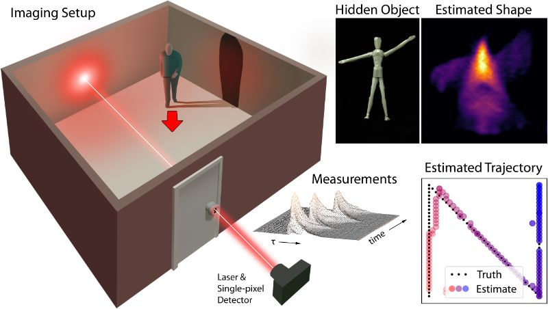

# Keyhole Imaging Code & Dataset

Code associated with the paper "Keyhole Imaging: Non-Line-of-Sight Imaging and Tracking of Moving Objects Along a Single Optical Path" by Chris Metzler, David Lindell, and Gordon Wetzstein.

## Abstract
Non-line-of-sight (NLOS) imaging and tracking is an emerging technology that allows the shape or position of objects around corners or behind diffusers to be recovered from transient, time-of-flight, measurements. However, existing NLOS approaches require the imaging system to scan a large area on a visible surface, where the indirect light paths of hidden objects are sampled. In many applications, such as robotic vision or autonomous driving, optical access to a large scanning area may not be available, which severely limits the practicality of existing NLOS techniques. Here, we propose a new approach, dubbed keyhole imaging, that captures a sequence of transient measurements along a single optical path, for example, through a keyhole. Assuming that the hidden object of interest moves during the acquisition time, we effectively capture a series of time-resolved projections of the object's shape from unknown viewpoints. We derive inverse methods based on expectation-maximization to recover the object's shape and location using these measurements. Then, with the help of long exposure times and retroreflective tape, we demonstrate successful experimental results with a prototype keyhole imaging system.

## Dependencies
Dependencies are best handled using Anaconda. All dependencies for the testing code can be installed by running "conda env create -f KeyholeEnvironment.yml".

## Running the Code
Demo.py will reconstruct the objects and their trajectories. Modify the "reconstruction" argument to set which object/trajectory is reconstructed.

Cuda is disabled by default. Enabling it will dramatically speed up the reconstructions, but requires a GPU with around 10GB of RAM.

## Comments and Questions
Contact cmetzler@stanford.edu.